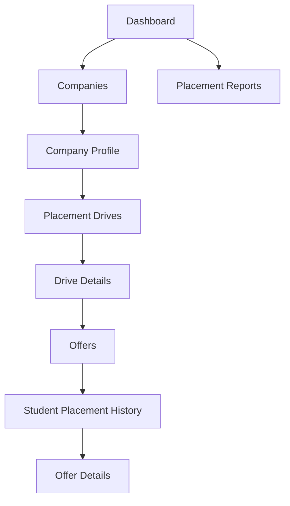

# Placement Management System

## Overview
A professional placement management system for employers, placement drives, student offers, placement history, and placement outcomes.

## Main Features
- Company master management
- Placement drive management
- Student management
- Placement offer management
- Student placement history
- Placement reports and insights
- Search and filtering

## Main Flow


## Data Flow
```text
Company → Placement Drive → Offer ← Student
```

## Documentation
- [UI Flow](docs/ui-flow.md)
- [ER Diagram](docs/er-diagram.md)
- [Technology Decisions](docs/technology-decision.md)
- [Screenshot Checklist](docs/screenshot-checklist.md)
